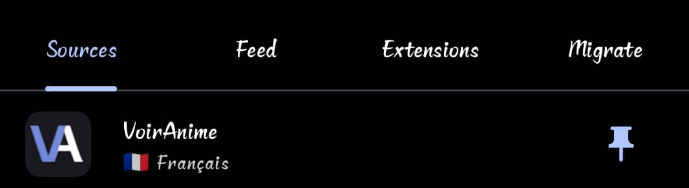
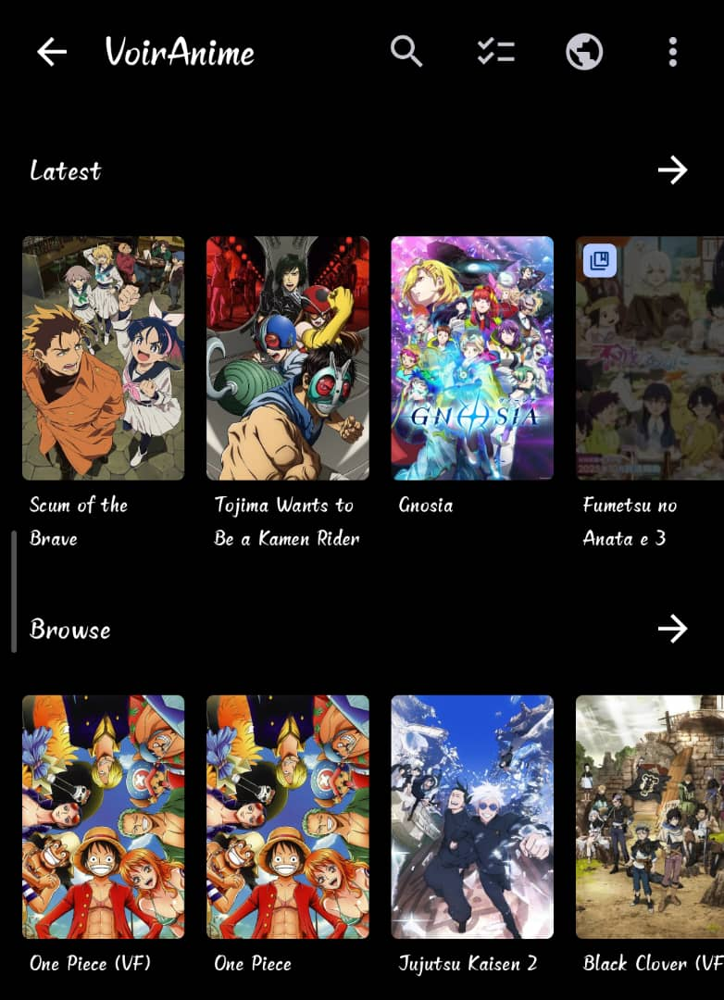
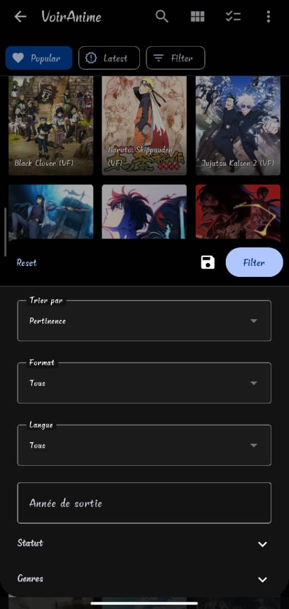
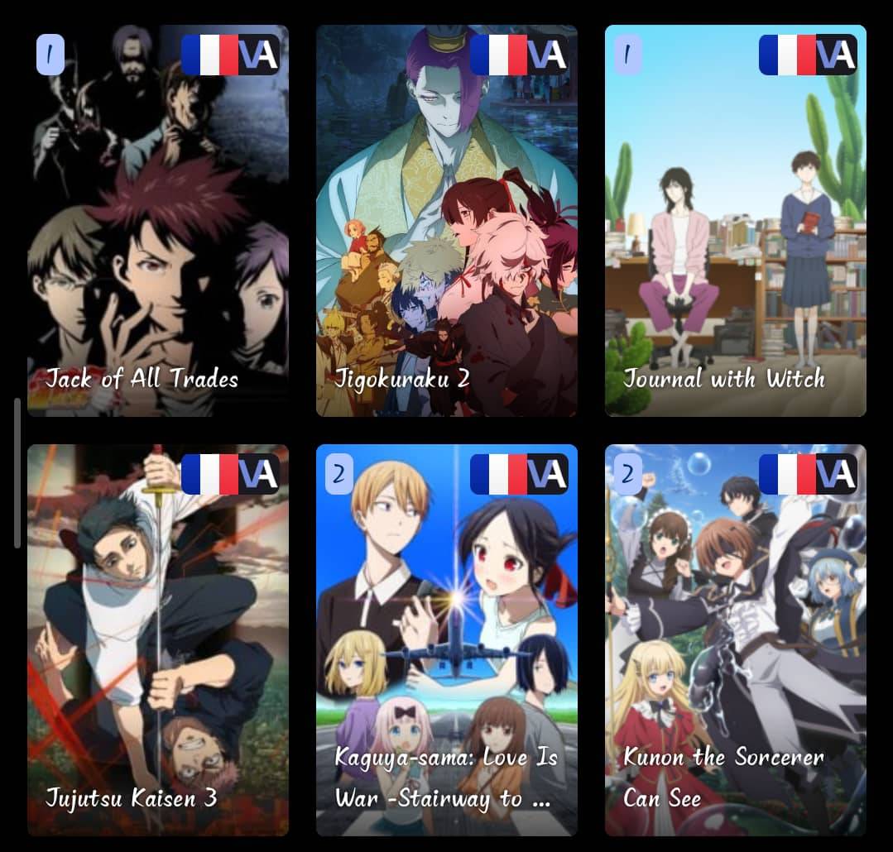
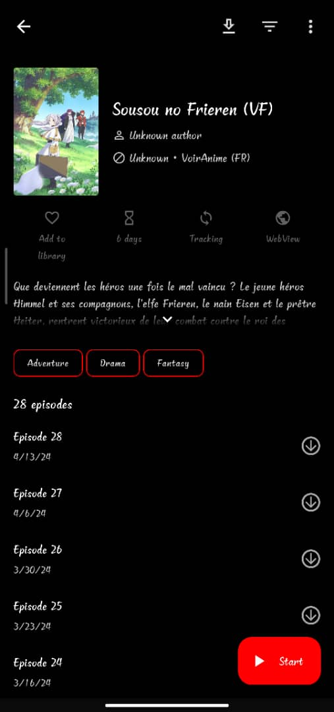

# VoirAnime Extension for Aniyomi

  

  <strong>French anime streaming extension for Aniyomi</strong>

---

## 📖 About

This is an **Aniyomi extension** that provides access to [VoirAnime](https://v6.voiranime.com), a popular French anime streaming website. Watch your favorite anime in VF (French dub) or VOSTFR (French subtitles) directly within the Aniyomi app.

### Features

- ✅ **Browse & Search** - Discover thousands of anime titles
- ✅ **Advanced Filters** - Filter by genre, year, status, format, and language
- ✅ **Multiple Video Servers** - Support for 5 different video players (VidMoly, Filemoon, Voe, StreamTape, VK)
- ✅ **VF & VOSTFR** - Choose between French dubbed or subtitled versions
- ✅ **Deep Link Support** - Open anime directly from browser links
- ✅ **Customizable Thumbnails** - Adjust image quality to save bandwidth
- ✅ **Latest Updates** - Stay up to date with new episodes

---

## 📸 Screenshots

### Extension in Sources List

### Browse Anime

### Advanced Filtering

### Anime Gallery

### Anime Details & Episodes

### Video Playback

---

## 🚀 Installation

### Prerequisites

- **[Aniyomi](https://github.com/aniyomiorg/aniyomi)** app installed on your Android device
- Android 6.0 (API 23) or higher

### Installation Steps

1. Download the latest `.apk` file from the [Releases](../../releases) page
2. Open **Aniyomi** app
3. Go to **Browse** → **Extensions**
4. Tap the **Install** button (📦 icon) in the top right
5. Select the downloaded `.apk` file
6. Grant necessary permissions if prompted
7. The extension will appear in your **Sources** list

---

## 🎯 Usage

### Browsing Anime

1. Open Aniyomi and go to **Browse** → **Sources**
2. Select **VoirAnime** (marked with 🇫🇷 Français)
3. Browse **Latest** updates or **Popular** anime
4. Use the **Filter** button to refine your search

### Search Filters

The extension provides comprehensive search filters:

- **Sort By**: Relevance, Popularity, Latest, Alphabetical, Rating, Views, New
- **Format**: TV, Movie, TV Short, OVA, ONA, Special
- **Language**: VF (French dub), VOSTFR (French subtitles)
- **Year**: Filter by release year
- **Status**: Completed, Ongoing, Canceled, On Hold
- **Genres**: Action, Adventure, Comedy, Drama, Fantasy, Romance, and more

### Deep Link Support

You can open anime directly from your browser:
1. Visit any anime page on v6.voiranime.com
2. The link will automatically open in Aniyomi
3. The anime will be loaded directly in the app

---

## ⚙️ Configuration

### Thumbnail Quality Settings

Customize image quality in **Extension Settings**:

- **110x150** - Very Small (minimal data usage)
- **125x180** - Small
- **175x238** - Medium Low
- **193x278** - Default
- **350x476** - Medium High
- **460x630** - Large
- **Original** - Highest quality (highest data usage)

Higher quality images consume more bandwidth but provide better visual experience.

---

## 🎬 Supported Video Players

The extension automatically extracts videos from multiple sources:

| Player | Host | Quality |
|--------|------|---------|
| **LECTEUR myTV** | VidMoly | Multiple qualities |
| **LECTEUR MOON** | Filemoon (f16px) | Multiple qualities |
| **LECTEUR VOE** | Voe.sx | Multiple qualities |
| **LECTEUR Stape** | StreamTape | Single quality |
| **LECTEUR FHD1** | VK/Mail.ru | Multiple qualities |

The app will display all available video sources for each episode. Choose the one that works best for you.

---

## 🛠️ Technical Details

### Built With

- **Language**: Kotlin
- **Min SDK**: Android 6.0 (API 23)
- **Framework**: Aniyomi Extension API
- **Architecture**: ParsedAnimeHttpSource

### Dependencies

This extension uses external video extractor libraries:
- `vidmoly-extractor` - VidMoly player support
- `filemoon-extractor` - Filemoon/f16px player support
- `voe-extractor` - Voe player support
- `streamtape-extractor` - StreamTape player support
- `vk-extractor` - VK/Mail.ru player support

---

## 🐛 Troubleshooting

### No videos appear
- Try a different video server/player
- Check your internet connection
- Some servers may be temporarily down

### Extension not showing in sources
- Make sure you installed the correct `.apk` file
- Restart the Aniyomi app
- Check that the extension is enabled in settings

### Videos won't play
- Some video hosts may be blocked in your region
- Try using a VPN if necessary
- Switch to a different video server

---

## 📝 License

This extension is provided as-is for personal use. Please respect the original content creators and copyright holders.

---

## ⚠️ Disclaimer

This extension is not affiliated with or endorsed by VoirAnime or Aniyomi. It is a third-party extension created for educational purposes. Users are responsible for complying with their local laws regarding streaming content.

---

## 🤝 Contributing

Contributions are welcome! Feel free to:
- Report bugs
- Suggest new features
- Submit pull requests
- Improve documentation

---

  Made with ❤️ for the anime community

